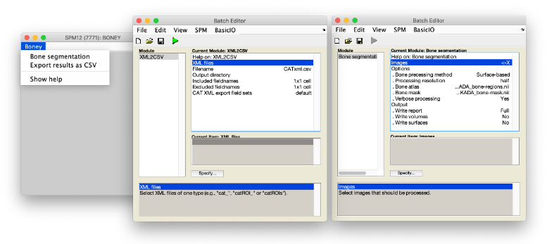

# Boney
This is the Boney toolbox, an extension to [SPM12](http://www.fil.ion.ucl.ac.uk/spm/software/spm12/) and its [CAT12](http://www.neuro.uni-jena.de/cat) toolbox, supporting the extraction of measurements related to the bone and head structure. It is developed by *Polona Kalc* and *Robert Dahnke* and is a free but copyright software, distributed under the terms of the <em>[GNU General Public License](http://www.gnu.org/licenses/gpl-2.0.html)</em> as published by the Free Software Foundation; either version 2 of the License, or (at your option) any later version.

If you find any bugs, please report them to <polona.kalc@med.uni-jena.de> or <robert.dahnke@uni-jena.de>.

## Introduction 
As Ingmar Bergman posited in The Seventh Seal: *'A skull is more interesting than a naked woman.'* Yet the neuroimaging community has continued to strip the skull and discard the relevant information hidden in the layers of the head tissues. 
The increasing interest in the bone-brain crosstalk suggests the implication of the bone metabolism in mood, cognition, energy metabolism, etc. ([Khrimian et al. 2017](10.1084/jem.20171320); [Nakamura, Imaoka, and Takeda 2021](https://doi.org/10.1080/00207454.2020.1770247) ; [Obri et al. 2018](10.1038/nrendo.2017.181); [Rousseaud et al. 2016](https://doi.org/10.1515/hmbci-2016-0030)). Furthermore, low bone mineral density (BMD)/osteoporosis has been associated to an increased risk of Alzheimer's disease ([Kostev, Hadji, and Jacob 2018](https://doi.org/10.3233/JAD-180569); [Zhang et al. 2022](https://doi.org/10.1016/j.jamda.2022.07.012); [Xiao et al. 2023](10.1212/WNL.0000000000207220)).
However, the bone mineral density measures are typically not available in open-access brain-imaging databases, such as IXI, ADNI, AIBL, OASIS, etc. We therefore decided to extract a proxy measure for head BMD from the skull. 

## Quick method
To extract bone parameters from MRI data, we use a refined SPM tissue segmentation procedure and derive different cranial intensity and thickness measures that can be used to approximate the head BMD measure.
An estimation of the head's skin-fold (subcutaneous fat thickness) is also available and can be used as an additional information to the typically available BMI measure.

## Quick start
Install Matlab/Octave, [SPM12](http://www.fil.ion.ucl.ac.uk/spm/software/spm12/) and its [CAT12](http://www.neuro.uni-jena.de/cat) toolbox.
Download the zip-file and unpack it into your SPM12 toolbox directory. 

Run SPM and open the toolbox:

<code>spm fmri; spm_boney;</code>

Open the bone processing batch: 

and select the structural images that should be processed. Adapt relevant parameters (see paragraph Parameters and SPM batch help) and start the processing. Voilà! 

After the processing has finished, you can use the XML2CSV batch to extract the estimated (bone) values for further analyses.

## Parameters
You can select different predefined SPM and CAT segmentation routines with various predefined settings. 
SPM's routine is faster but may fail in some cases, often because of the inital affine registration problems. 

In addition, you can select between different advanced processing routines for the bone measures (e.g., SPMmat, volume, surface).  
We would advise the use of the refined measure, which is robust to the exclusion of the parts within the diploë.

Furthermore, you can specify which output files to write, e.g., the short bone-report (as a JPG), or the processed NIFTI volumes or GIFTI surfaces that are also shown in the bone-report.

## References
You can find out more about the bone and skin-fold thickness measures in the paper ...

